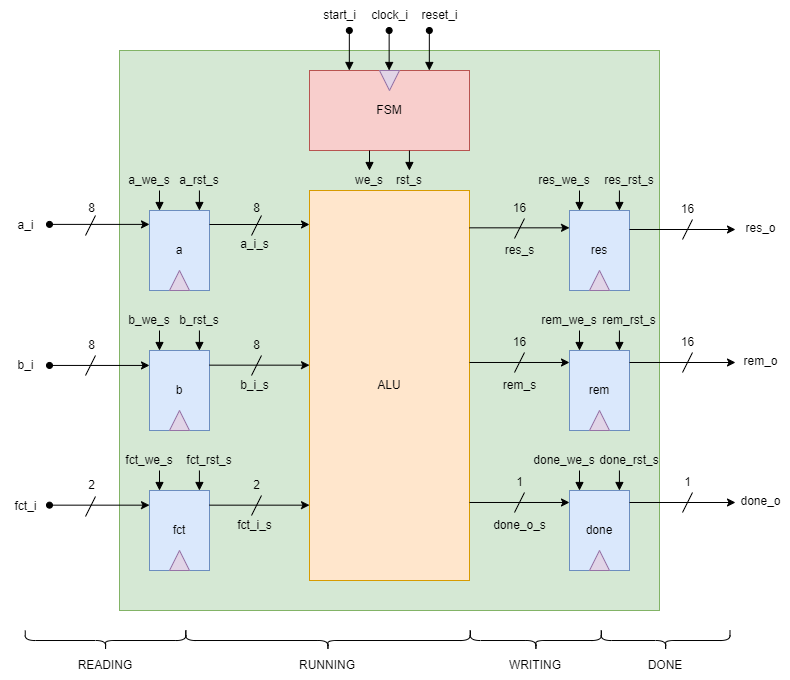

# Calculator_Verilog

This document outlines the project to create a simple 8-bit calculator using Verilog. The calculator is capable of performing the following operations:

- Addition of two values: \(a_i + b_i\)
- Subtraction of two values: \(a_i - b_i\)
- Multiplication of two values: \(a_i * b_i\)
- Euclidean division of two values: \(a_i / b_i + a_i % b_i\)

To select the operation to be performed, it uses the signal fct_i to set it:

- Addition: 00
- Subtraction: 01
- Multiplication: 10
- Euclidean division: 11

The results are displayed in the signals res_o and rem_o (indicating the remainder of the Euclidean division), with the signal done_o indicating the end of the calculation.

## Finite State Machine

This system has a FSM consisting of five states:
1. IDLE: the system waits for the start_i command to become high to start the operation, otherwise the state continues remains IDLE
2. READING: after receiving start_i high, it reads the values a_i and b_i, and fct_i to define the chosen function
3. RUNNING: ALU performs the selected function
4. WRITING: after the calculation, the results are written in the registers
5. DONE: in this state, the done_o high signal indicates that the results are available at the output

Thus, the time for the calculation of any operation is 4 clock periods, with the fourth clock period being the time when the results are available in the output.
To reset all values and start a new calculation, set reset_i to low level.

## Organization of Files

In this repository, the folders are divided into:

- **LIB**: contains the configuration files generated by QuestaSim
- **others**: contains old/discontinued versions
- **SRC**: this folder contains the RTL files for the calculator with the corresponding testbench for each module
- **verilator**: contains the files to simulate the calculator with verilator
- **yosys**: contains the files to inject errors into the circuit

- **compile.sh**: script created to simulate the calculator with QuestaSim. Run the following command in the terminal: `bash compile.sh`